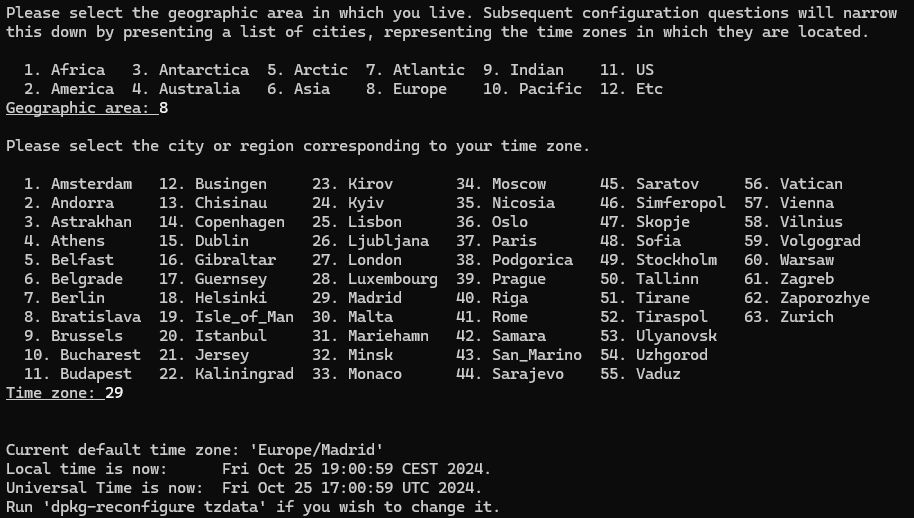
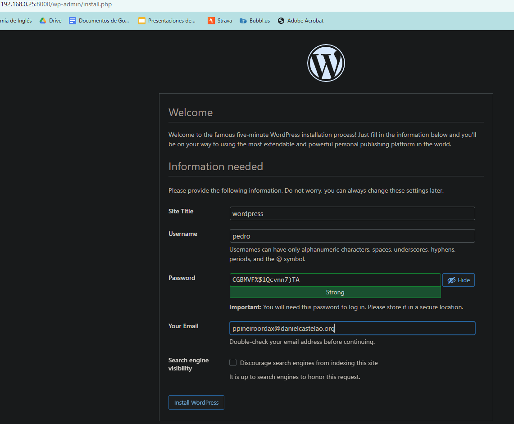
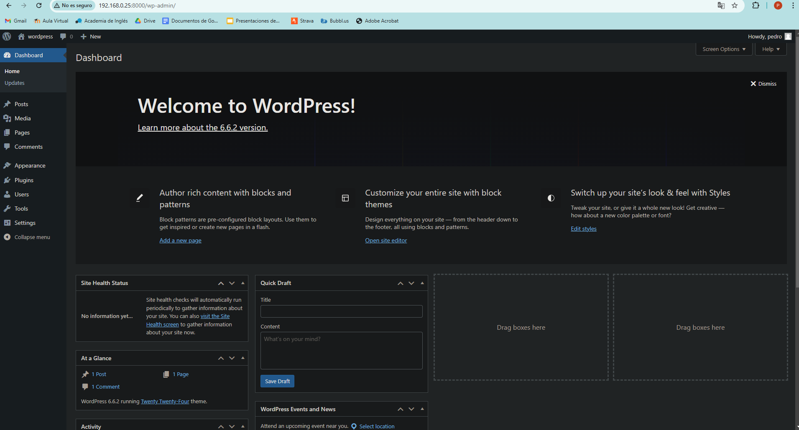

# Tarea 4 SXE -- Pedro Piñeiro
## 1. Utiliza la imagen de Ubuntu , tag 22 y apoyandote en esta guía sigue sus instrucciones para instalar LAMP en dicho contenedor
### Primero descargamos la imagen requerida de ubuntu 22.04 y revisamos que se haya descargado correctamente
```
docker pull ubuntu:22.04
docker images
```
### Ahora vamos a crear un contenedor con la imagen y arrancarlo 
```
docker container create -i -t -p 8000:80 --name ubuntuLAMP ubuntu:22.04
docker start --attach -i ubuntuLAMP
```

___
### Estando dentro del contenedor, actualizamos los paquetes
```
apt update
```
### Despues instalamos Apache
```
apt install -y apache2 apache2-utils
```
### Ahora instalamos MariaDB
```
apt install -y mariadb-server mariadb-client
```
### Iniciamos MariaDB y hacemos segura la instalacion de MySQL
```
service mariadb start
mysql_secure_installation
```
```
service mariadb start
mysql_secure_installation
```
#### Para la instalación, primero se nos pedirá la contraseña de root, la dejamos en blanco y presionamos enter, en el siguiente paso ponemos "n", luego le decimos que si a cambiar la contraseña del root y la cambiamos, y por ultimo le damos que si al resto de preguntas

### Ahora instalamos PHP completando la información que nos pide
```
apt install -y php php-mysql libapache2-mod-php
```

### Probamos que todo este funcionando correctamente y reiniciamos el servicio de apache
```
echo "<?php phpinfo(); ?>" | tee /var/www/html/info.php
service apache2 restart
```
### Por último accedemos al navegador para verificar
```
http://(ip de la maquina)/info.php
```

___
## 2. Instala wordpress en el contenedor
### Primero instalamos las dependencias necesarias
```
 apt update
  apt install apache2 \
  ghostscript \
  libapache2-mod-php \
  mysql-server \
  php \
  php-bcmath \
  php-curl \
  php-imagick \
  php-intl \
  php-json \
  php-mbstring \
  php-mysql \
  php-xml \
  php-zip
```
### Seguidamente instalamos wordpress
```
sudo mkdir -p /srv/www
sudo chown www-data: /srv/www
curl https://wordpress.org/latest.tar.gz | tar zx -C /srv/www
```

### Damos los permisos necesarios
```
chown -R www-data:www-data /srv/www
```
___
### Ahora configuramos apache para WordPress
### Pero primero instalamos nano para editar el archivo (si no lo tenemos)
```
apt update
apt install nano
```
### Ahora creamos y editamos el archivo de configuración 
```
touch /etc/apache2/sites-available/wordpress.conf
nano /etc/apache2/sites-available/wordpress.conf
```
### Pegamos este contenido dentro del archivo
```
<VirtualHost *:80>
     ServerAdmin webmaster@localhost
     DocumentRoot /srv/www/wordpress
     ServerName wordpress.local
     ServerAlias www.wordpress.local
     <Directory /srv/www/wordpress>
         Options FollowSymLinks
         AllowOverride All
         Require all granted
     </Directory>
     ErrorLog ${APACHE_LOG_DIR}/error.log
     CustomLog ${APACHE_LOG_DIR}/access.log combined
 </VirtualHost>
```
### Initializamos el sitio de WordPress y recargamos apache
```
a2ensite wordpress
service apache2 reload
```
### Habilitamos la reescritura del URL y deshabilitamos sitio predeterminado
```
a2enmod rewrite
a2dissite 000-default
```
### Reiniciamos apache
```
service apache2 restart
```
___
### Ahora configuraremos la Database
```
mysql -u root
CREATE DATABASE wordpress;
CREATE USER 'pedro' IDENTIFIED BY '<your-password>';
GRANT SELECT, INSERT, UPDATE, DELETE, CREATE, DROP, ALTER ON wordpress.* TO 'pedro';
FLUSH PRIVILEGES;
QUIT;
```


### Para configurar WordPress para acceder a la base de datos copiamos el archivo de configuracion
```
cp /srv/www/wordpress/wp-config-sample.php /srv/www/wordpress/wp-config.php
```
### Establecemos los datos

### También los datos obtenidos en la guia, que son claves generadas aleatoriamente

### Accedemos al navegador con nuestra ip y el puerto 8000 para verificar
```
http://192.168.0.25:8000/wp-admin/setup-config.php
```

### Por ultimo creamos la cuenta de WordPress y accedemos a ella

